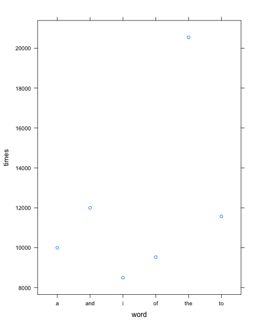
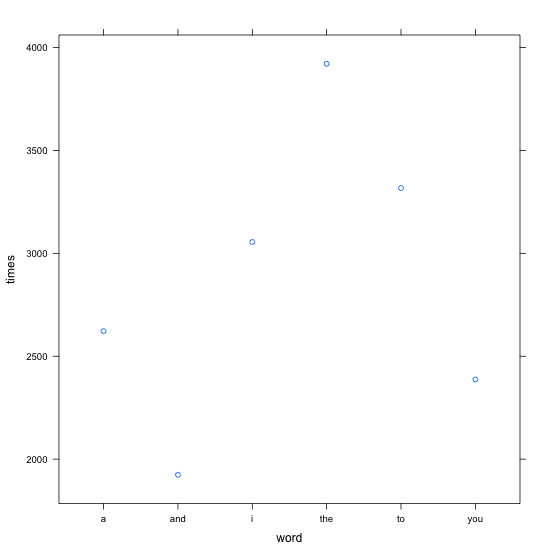
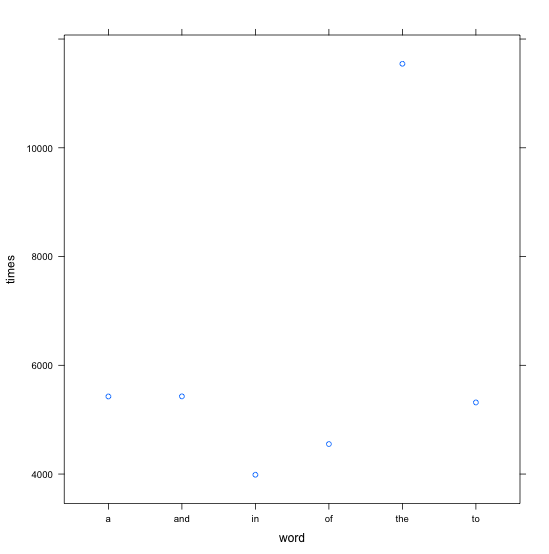

## Introduction

This presentation was made during the "Capstone Project" on "Data Scientist" certification on Coursera.

The goal is develop an application for predictive text writing. 

To achieve this objective, we are going to apply text mining techniques on three different text files, for analyze the words contained on them.

        1. en_US.blogs.txt
        2. en_US.twitter.txt
        3. en_US.news.txt

**In this document you will find the first results obtained during the basic analysis made on this three files**

--- .class #id 

## What we have made

For the first analysis we have developed three functions, that allow us to load, sample and process each of the files

1 getSample

function(filename, file_sample, file_info){...}

Receives a *filename*, takes a 40% sample of it and save it in *file_sample*. Also it creates a new *file_info* file with the number of rows of the *filename* file.

--- .class #id

## What we have made

2 tokenize 

function(filename, token_name, size){...}

Receives a *filename* and process first *size* rows to obtain a data set with all the words contained on it and its frequency. Then store it in *token_name* file. This function convert all words to lower case and filter characters and words using regular expressions:
* Special characters (i.e.: &%$·¿?*^¨Ç`....)
* Bad words (i.e.: fuck, asshole, bicht, ...)

3 frequency 

function(dictionary, word){...}

Receives a *dictionary* (data set with pair word-number of times it appears) and search for the *word* on it. Then it returns the number of times that the *word* appears.

--- .class #id

## Analysis: Blogs file

* Number of rows: 899.288

* Sample size processed: 10.000 random rows

* Number of different token (words) detected: 31.989

Top six tokens founded

--- .class #id

## Analysis: Twitter file

* Number of rows: 2.360.148

* Sample size processed: 10.000 random rows

* Number of different token (words) detected: 15.176

Top six tokens founded

--- .class #id

## Analysis: News file

* Number of rows: 1.010.242

* Sample size processed: 6.000 random rows

* Number of different token (words) detected: 22.968

Top six tokens founded

--- .class #id

## Analysis: Interesting things 

First observations of each file are prepositions and pronouns, we will have to work on them for the app.

People are interested in health and wellness. Words like "health", "running", "sport" have important relevance.

Bad feelings, things and so on ("hate", "sad", "bad"), are less common than good things ("good", "love")

As United States is not in conflict, words like "war", "army", "fight", "dead" have less occurrences.

--- .class #id

## Prediction algorythm and Shiny app

In order to create a useful predictive text writing app, we have to elaborate a complex algorythm that allow generate automatic words based on the words typed before. 

The idea we want to develop is scan the first one (or two) word user type and suggest the second (or third) one. 

For doing that, we have to analyse tokens composed by two word and look for the most common combination.

One important problem to solve is the size of the data set we will use for apply predictive techniques.

Search along the data set has to be as quickly as it can.

--- .class #id

